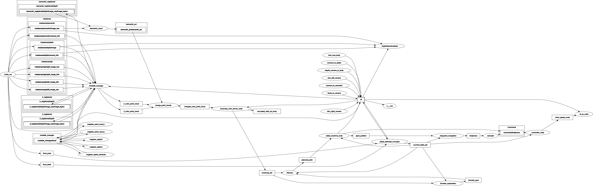

# TUM Autonome Systeme: Drone Exploration in Unknown Cave Environments 

## 📌 Description and Task

This repository is built upon part of the code in course "Autonome Systeme" (LRG6300) taught at the Technical University of Munich(TUM), aiming to develop frameworks for our drone's autonomous exploration mission. It is based on a Unity virtual environment and implemented using the Robot Operating System (ROS). Final Group Report: [report](./ReadMe_file/AS_24WS_Project_Report.pdf)

## ✈️ Members
* Qianru Li
* Ziou Hu
* Kecheng Zhou
* Dian Yu
* Wenjie Xie

## 🚦 Prerequisites and Running

* Ubuntu 20.04
* ROS noetic

Being in the main folder of your catkin workspace:
```shell
git clone https://gitlab.lrz.de/tum24_as_09_group/as.git
```
Download the unity environment `AutonomousSystem.zip` from [here](https://drive.google.com/file/d/1HQ6VXeGtA4XMW2ph0_ETmt2H92DOaxsN/view?usp=sharing) and extract into `src/simulation`.

Extra packages need to be installed for running the program.
```shell
sudo apt install git wstool wget libtool apt-utils python3-catkin-tools
sudo apt install ros-${ROS_DISTRO}-octomap-rviz-plugins ros-${ROS_DISTRO}-octomap-server
sudo apt install ros-noetic-depth-image-project
sudo apt-get install ros-noetic-octomap ros-noetic-octomap-mapping
sudo apt-get install ros-noetic-ompl ros-noetic-fcl
```
After installation, build the project:
```shell
catkin build
source devel/setup.bash
```
Then launch global exploration_mission file:
```shell
roslaunch simulation mission.launch
```
**Note:** To switch between **RGB-mapping** and **Depth-mapping** modes, you need to **comment/uncomment the respective lines** in the **OctoMap YAML file** within the **Perception package**.

# 🏆 Result Presentation

Exploration Video :

[demo_video1.mp4](./ReadMe_file/demo1.mp4)

[demo_video2.mp4](./ReadMe_file/demo2.mp4)

# 📖 Rosgraph

# 📌 Task List

✅ Find and locate four lights in the cave environment.

✅ Generate a 3D voxel-grid representation of the cave.

✅ Develop a state machine for the drone.

✅ Build the perception pipeline for environmental awareness.

✅ Implement a path planner and trajectory planner for autonomous navigation.

✅ Success in the full mission (Best Completion Time: **10 min 50 s**) 

# 🍔 Modules
## 1️⃣ Perception
The perception module implements two different approaches for mapping:: ***RGB Color Mapping*** ; ***Direct Depth Hight Mapping***

***RGB Color Mapping*** ： The RGB Color Mapping approach utilizes multiple cameras mounted on the drone, including two RGB cameras, one depth camera, and one semantic camera. To address misalignment caused by different camera positions, the depth camera is first registered with the other cameras. Then, all pixel information is projected into a unified 3D point cloud, which is further processed to generate a 3D voxel representation using the OctoMap framework.

***Direct Depth Hight Mapping*** : The Direct Depth Height Mapping approach follows a more straightforward process. It begins by projecting depth images into a 3D point cloud. The depth camera’s point clouds are then directly used to generate an OctoMap representation of the environment. 

Both voxel maps generated from these approaches are essential for the **Navigation Module**, where they are utilized for **obstacle avoidance** and **path planning**.
### Dependencies
 - Octomap: A package which can get the occupancy Voxels and projected map from 3D point cloud data.
 - Depth image Proc: A package is used for Sensor Registration and projecting Point Cloud.

### Key Nodes (Partial List):

 - /merge_point_clouds 
 - /semantic_cloud 
 - /octomap_color_server_node
 - /octomap_color_node
 - /light_detection_node

### Key Topics (Partial List):

- /occupied_cells_vis_array **(occupied voxels)**
- /octomap_full **(contains all octomap information)**
- /semantic_pcl/semantic_pcl **(publishes semantic cloud)**
- /point_cloud **(Depth Point Cloud)**
- /merged_color_point_cloud **(merged color Point Cloud)**
- /detected_points **(position and index of detected points)**

## 2️⃣ Navigation
The ***Navigation*** module leverages the voxel maps (OctoMap) generated by the Perception module for both ***obstacle avoidance*** and ***path planning***. It consists of a few key components to enable frontier-based exploration, global path planning, and trajectory generation, ensuring the drone can safely and efficiently navigate through partially known or unknown environments.
### Dependencies
- Octomap: Provides 3D voxel occupancy mapping; used by both the frontier_exploration node and the Planner node for free/occupied checks.
- OMPL: Provides multiple sampling-based planning algorithms (e.g., RRT*, PRM*, Informed RRT*) for global path planning.
- FCL: Works with the OctoMap to perform collision checks and ensure a planned path is free of obstacles.
- mav_trajectory_generation: Converts sets of waypoints or higher-level goals into smooth polynomial trajectories, which can be published to the flight controller.
- PCL: For point cloud processing, including OPTICS clustering.

### Key Nodes (Partial List):
- /sampler
- /waypoint_navigation
- /Planner
- /frontier_exploration

### Key Topics (Partial List):
- /octomap_full **(ColorOctree for environment occupancy)**
- /detected_points **(positions of newly detected lights, used to expand exploration radius)**
- /current_state_est **(drone’s pose; optional usage for bounding box references)**
- /planned_path **(intermediate or final path, if used for RViz visualization)**
- /goal_position **(PoseStamped messages or raw position goals)**
- /frontier_goal **(the goal point from frontier exploration)**
- /trajectory **(polynomial trajectory for the drone to follow)**
- /trajectory_markers **(RViz visualization markers)**
## 3️⃣ Control
The ***Control*** module implements a geometric controller for the drone that tracks trajectories while maintaining stability. It uses a ***Linear Quadratic Regulator*** (LQR) for position control and a PD controller for attitude control. The module computes desired thrusts and torques for the quadrotor's rotors based on the current state and desired trajectory points.

### Dependencies
- Eigen: For matrix operations and mathematical computations
- TF and TF Conversions: For coordinate frame transformations
- MAV Messages: For actuator commands and trajectory representations
- Navigation Messages: For odometry and state estimation

### Key Nodes (Partial List):
- /controller_node: **Main geometric controller that converts desired trajectory points to rotor commands**
- /traj_publisher: **Generates and publishes trajectory points (can create static poses or circular trajectories)**
- /traj_planner: **Position and yaw controller using PID**

### Key Topics (Partial List):
- /command/trajectory: **Desired state trajectory for the drone to follow**
- /current_state_est: **Current state (position, orientation, velocity) of the drone**
- /rotor_speed_cmds: **Actuator commands for the drone's rotors**
- /desired_state: **Trajectory waypoints published by trajectory planner**
- /state_machine/expected_height: **Expected flight height from state machine**

## 4️⃣ State Machine
The ***State Machine*** module manages high-level mission control for the drone, transitioning between different flight states based on the current situation and mission goals. It uses a finite state machine architecture to handle transitions between takeoff, navigation, hovering, and landing phases, and coordinates with the navigation and control modules.

### Dependencies
- ROS core libraries
- Geometric libraries (Eigen, TF, TF2)
- Cubic spline interpolation for smooth trajectory generation
- Navigation and trajectory messages

### Key Nodes (Partial List):
- /state_machine: **Main node implementing the finite state machine**
- ***States include***:
  - TakeoffState: **Controls drone takeoff**
  - ToCaveState: **Navigates to cave entrance**
  - HoverState: **Maintains position**
  - LandingState: **Controls landing**
  - TurnState: **Rotates to specific yaw angle**
  - ForwardState: **Moves forward in specific direction**

### Key Topics (Partial List):
- /current_state_est: **Current drone state used for decision making**
- /planned_path: **Path planning input from navigation module**
- /command/trajectory: **Commands sent to drone controller**
- /goal_position: **Current goal waypoint**
- /frontier_goal: **Goal point from frontier exploration**
